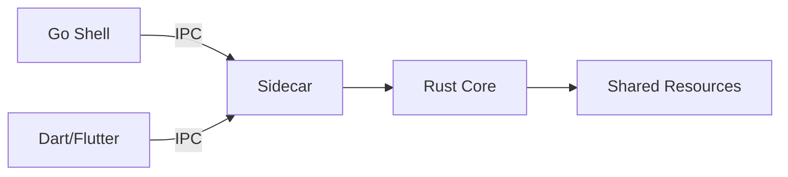
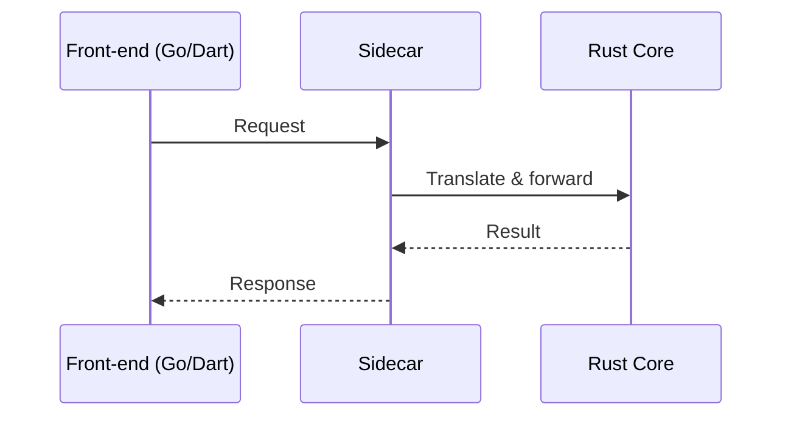

# Architecture Overview

This project is composed of a Rust core surrounded by Go and Dart front-ends. A sidecar process mediates communication between components and coordinates access to shared resources.

## Components

- **Rust Core** – Implements the primary application logic, model management and shared state. The core is built as a Cargo workspace containing the `core`, `sidecar`, and `cli_tui` crates.
- **Go Front‑end** – Provides a shell interface that embeds the sidecar client and forwards user commands to the Rust core.
- **Dart Front‑end** – Supplies command line and Flutter-based interfaces. These clients communicate with the sidecar to access core functionality.
- **Sidecar** – Runs alongside the front‑ends, translating requests and responses between the user interfaces and the Rust core. All front‑ends talk to the sidecar through local IPC.
- **Shared Resources** – Model files, configuration, and logs are shared across languages. The sidecar manages access to these resources so that the core remains language agnostic.

## Data Flow

## Sidecar Interaction Sequence

The diagrams above depict how front-ends communicate with the Rust core through the sidecar and how data flows to shared resources.

## Python to Rust migration

Legacy Python utilities are being replaced with Rust implementations.  The first
step introduces a small `git_sidecar` binary that mirrors portions of the
`GitRepo` helper.  Python code can opt into the Rust path by setting
`AIDER_USE_RUST=1`.  Progress and upcoming milestones are documented in
[`MIGRATION.md`](MIGRATION.md).

